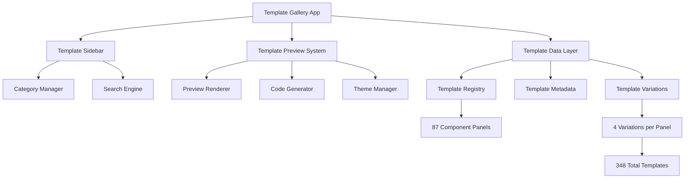
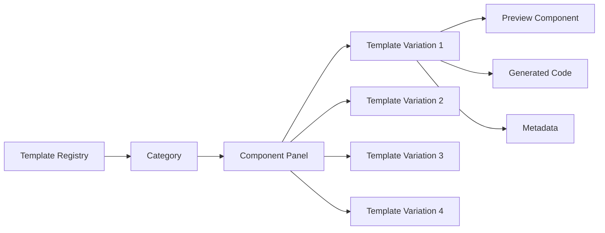

# Design Document: Template Library Expansion

## Overview

This design document outlines the architecture for expanding the Template Gallery from its current 5 header templates to a comprehensive library of 87 component panels, each with 4 unique template variations, totaling 348 professional-grade templates. The expansion maintains the existing Next.js/TypeScript/Tailwind CSS architecture while introducing scalable data structures, efficient rendering systems, and robust template generation capabilities.

## Architecture

### High-Level Architecture



### Template Data Architecture



## Components and Interfaces

### Core Data Structures

#### Template Registry Interface
```typescript
interface TemplateRegistry {
  categories: TemplateCategory[]
  totalPanels: number
  totalTemplates: number
  version: string
}

interface TemplateCategory {
  id: string
  name: string
  description: string
  icon: LucideIcon
  panels: ComponentPanel[]
  panelCount: number
}

interface ComponentPanel {
  id: string
  name: string
  description: string
  category: string
  complexity: 'simple' | 'moderate' | 'complex'
  features: string[]
  useCases: string[]
  variations: TemplateVariation[]
  tags: string[]
  dependencies: string[]
}

interface TemplateVariation {
  id: string
  name: string
  description: string
  style: 'minimal' | 'modern' | 'classic' | 'bold'
  previewComponent: React.ComponentType
  generatedCode: string
  metadata: TemplateMetadata
}

interface TemplateMetadata {
  createdDate: string
  version: string
  author: string
  complexity: number
  responsive: boolean
  accessible: boolean
  darkModeSupport: boolean
  dependencies: string[]
  implementationNotes: string[]
}
```

### Extended Template Categories

Based on the current 14 categories, here's the expansion to accommodate 87 component panels:

#### 1. Navigation (12 panels)
- Header Panel (4 variations: Minimal, Modern SaaS, E-commerce, News Portal)
- Top Navigation Bar (4 variations: Horizontal, Mega Menu, Dropdown, Sticky)
- Secondary Navigation (4 variations: Breadcrumb, Tab, Sidebar, Mobile)
- Hamburger Menu (4 variations: Slide, Overlay, Push, Accordion)
- Breadcrumb Panel (4 variations: Simple, Icon, Dropdown, Hierarchical)
- Footer Panel (4 variations: Simple, Multi-column, Newsletter, Social)
- Mobile Navigation (4 variations: Bottom Tab, Drawer, Full Screen, Floating)
- Pagination (4 variations: Numbers, Arrows, Load More, Infinite Scroll)
- Skip Links (4 variations: Basic, Enhanced, Keyboard, Screen Reader)
- Site Map (4 variations: Tree, Grid, Accordion, Search)
- Navigation Drawer (4 variations: Left, Right, Overlay, Push)
- Mega Menu (4 variations: Grid, List, Image, Category)

#### 2. User Interface (8 panels)
- Search Panel (4 variations: Simple, Advanced, Autocomplete, Voice)
- Language Selector (4 variations: Dropdown, Flag, Modal, Inline)
- Location Selector (4 variations: Map, Dropdown, Autocomplete, Geolocation)
- Login Panel (4 variations: Modal, Page, Sidebar, Social)
- Notification Panel (4 variations: Toast, Banner, Dropdown, Sidebar)
- User Account (4 variations: Dropdown, Profile Card, Settings, Dashboard)
- Theme Switcher (4 variations: Toggle, Dropdown, Slider, Auto)
- Accessibility Controls (4 variations: Toolbar, Menu, Floating, Inline)

#### 3. Content Display (10 panels)
- Hero Section (4 variations: Image, Video, Gradient, Split)
- Card Layout (4 variations: Basic, Image, Action, Hover)
- List Display (4 variations: Simple, Detailed, Grid, Timeline)
- Table Display (4 variations: Basic, Sortable, Filterable, Responsive)
- Modal Dialog (4 variations: Basic, Form, Confirmation, Full Screen)
- Accordion (4 variations: Single, Multiple, Nested, Icon)
- Tabs (4 variations: Horizontal, Vertical, Pills, Underline)
- Carousel (4 variations: Image, Card, Testimonial, Product)
- Timeline (4 variations: Vertical, Horizontal, Interactive, Milestone)
- Progress Indicator (4 variations: Bar, Circle, Steps, Loading)

#### 4. Forms and Input (8 panels)
- Contact Form (4 variations: Simple, Multi-step, Floating Labels, Inline)
- Newsletter Signup (4 variations: Inline, Modal, Sidebar, Footer)
- Search Form (4 variations: Simple, Advanced, Filters, Suggestions)
- Login Form (4 variations: Standard, Social, Two-factor, Passwordless)
- Registration Form (4 variations: Single Page, Multi-step, Social, Wizard)
- Feedback Form (4 variations: Rating, Comment, Survey, Quick)
- File Upload (4 variations: Drag Drop, Button, Progress, Multiple)
- Form Validation (4 variations: Inline, Summary, Tooltip, Real-time)

#### 5. Media and Gallery (9 panels)
- Photo Gallery (4 variations: Grid, Masonry, Lightbox, Carousel)
- Video Player (4 variations: Basic, Custom Controls, Playlist, Live)
- Image Slider (4 variations: Fade, Slide, Zoom, Thumbnail)
- Media Grid (4 variations: Responsive, Masonry, Justified, Pinterest)
- Video Gallery (4 variations: Grid, List, Featured, Category)
- Audio Player (4 variations: Mini, Full, Playlist, Podcast)
- Image Comparison (4 variations: Slider, Side by Side, Overlay, Hover)
- Media Upload (4 variations: Drag Drop, Preview, Progress, Crop)
- Slideshow (4 variations: Auto, Manual, Thumbnail, Full Screen)

#### 6. News and Content (6 panels)
- Breaking News Ticker (4 variations: Horizontal, Vertical, Fade, Slide)
- Article Card (4 variations: Horizontal, Vertical, Featured, Minimal)
- News Grid (4 variations: Masonry, Equal Height, Featured, Category)
- Live Updates (4 variations: Timeline, Feed, Ticker, Notification)
- Trending Topics (4 variations: List, Tags, Carousel, Sidebar)
- Most Read (4 variations: List, Cards, Sidebar, Numbered)

#### 7. E-commerce (8 panels)
- Product Card (4 variations: Grid, List, Featured, Quick View)
- Shopping Cart (4 variations: Dropdown, Sidebar, Modal, Mini)
- Product Gallery (4 variations: Zoom, Thumbnail, 360, Video)
- Price Display (4 variations: Simple, Comparison, Discount, Bundle)
- Add to Cart (4 variations: Button, Quantity, Options, Wishlist)
- Product Filter (4 variations: Sidebar, Dropdown, Tags, Advanced)
- Checkout Form (4 variations: Single Page, Multi-step, Guest, Express)
- Product Reviews (4 variations: Stars, Detailed, Summary, Photos)

#### 8. Social and Engagement (6 panels)
- Social Share (4 variations: Icons, Buttons, Floating, Inline)
- Comment System (4 variations: Threaded, Flat, Moderated, Social)
- Rating System (4 variations: Stars, Thumbs, Scale, Emoji)
- Follow Button (4 variations: Simple, Count, Social, Newsletter)
- Social Feed (4 variations: Timeline, Grid, Cards, Minimal)
- User Profile (4 variations: Card, Header, Sidebar, Modal)

#### 9. Business and Corporate (8 panels)
- Team Member (4 variations: Card, Grid, List, Detailed)
- Testimonial (4 variations: Card, Carousel, Grid, Quote)
- Pricing Table (4 variations: Simple, Comparison, Featured, Toggle)
- Service Card (4 variations: Icon, Image, Minimal, Detailed)
- About Section (4 variations: Split, Centered, Timeline, Stats)
- Contact Info (4 variations: Card, List, Map, Form)
- Company Stats (4 variations: Counter, Chart, Grid, Highlight)
- FAQ Section (4 variations: Accordion, List, Search, Category)

#### 10. Dashboard and Admin (6 panels)
- Dashboard Widget (4 variations: Chart, Stat, List, Progress)
- Data Table (4 variations: Basic, Advanced, Export, Inline Edit)
- Analytics Card (4 variations: Simple, Detailed, Chart, Comparison)
- Status Indicator (4 variations: Badge, Dot, Bar, Icon)
- Action Button (4 variations: Primary, Secondary, Icon, Dropdown)
- Settings Panel (4 variations: Form, Toggle, Tabs, Wizard)

#### 11. Marketing and Promotion (6 panels)
- Call to Action (4 variations: Button, Banner, Modal, Inline)
- Promotional Banner (4 variations: Top, Bottom, Sidebar, Overlay)
- Feature Highlight (4 variations: Grid, List, Carousel, Comparison)
- Newsletter Banner (4 variations: Top, Bottom, Modal, Sidebar)
- Discount Badge (4 variations: Corner, Overlay, Inline, Floating)
- Landing Hero (4 variations: Video, Image, Split, Minimal)

**Total: 87 Component Panels × 4 Variations = 348 Templates**

## Data Models

### Template Storage Structure

```typescript
// Template registry with all 87 panels
const TEMPLATE_REGISTRY: TemplateRegistry = {
  categories: [
    {
      id: "navigation",
      name: "Navigation",
      description: "Navigation components for website structure",
      icon: Navigation,
      panelCount: 12,
      panels: [
        {
          id: "header-panel",
          name: "Header Panel",
          description: "Website header with navigation and branding",
          category: "navigation",
          complexity: "moderate",
          features: ["Responsive", "Dark Mode", "Mobile Menu"],
          useCases: ["Website Header", "App Navigation", "Brand Display"],
          tags: ["header", "navigation", "branding", "responsive"],
          dependencies: ["@radix-ui/react-navigation-menu", "lucide-react"],
          variations: [
            {
              id: "header-minimal",
              name: "Minimal Header",
              description: "Clean, minimal header design",
              style: "minimal",
              previewComponent: MinimalHeaderPreview,
              generatedCode: generateMinimalHeaderCode(),
              metadata: {
                createdDate: "2026-01-07",
                version: "1.0.0",
                author: "Template Generator",
                complexity: 2,
                responsive: true,
                accessible: true,
                darkModeSupport: true,
                dependencies: ["lucide-react"],
                implementationNotes: [
                  "Uses Tailwind CSS for styling",
                  "Includes mobile hamburger menu",
                  "Supports dark mode toggle"
                ]
              }
            },
            // ... 3 more variations
          ]
        },
        // ... 11 more panels in navigation category
      ]
    },
    // ... 10 more categories
  ],
  totalPanels: 87,
  totalTemplates: 348,
  version: "1.0.0"
}
```

### Template Generation System

```typescript
interface TemplateGenerator {
  generateTemplate(panel: ComponentPanel, variation: TemplateVariation): GeneratedTemplate
  validateTemplate(template: GeneratedTemplate): ValidationResult
  optimizeTemplate(template: GeneratedTemplate): GeneratedTemplate
}

interface GeneratedTemplate {
  component: React.ComponentType
  code: string
  styles: string
  dependencies: string[]
  props: Record<string, any>
  examples: CodeExample[]
}

interface CodeExample {
  title: string
  description: string
  code: string
  preview: React.ComponentType
}
```

## Correctness Properties

*A property is a characteristic or behavior that should hold true across all valid executions of a system-essentially, a formal statement about what the system should do. Properties serve as the bridge between human-readable specifications and machine-verifiable correctness guarantees.*

### Property Reflection

After reviewing the prework analysis, I identified several areas where properties can be consolidated:

- Properties about template structure (1.2, 1.3) can be combined into comprehensive template organization properties
- Code generation properties (4.1, 4.2, 4.3, 4.4) can be consolidated into template generation correctness
- Theme and styling properties (9.1, 9.2, 9.3, 9.4) can be unified into design system consistency
- Validation properties (10.1, 10.3, 10.5) can be combined into template quality assurance

### Core Correctness Properties

**Property 1: Template Library Structure Integrity**
*For any* component panel in the template registry, it should have exactly 4 template variations and belong to a valid category
**Validates: Requirements 1.2, 1.3**

**Property 2: Template Code Generation Consistency**
*For any* generated template, it should include valid React/TypeScript code with proper imports, interfaces, and follow project conventions
**Validates: Requirements 4.1, 4.2, 4.3, 4.4**

**Property 3: Design System Compliance**
*For any* generated template, it should use consistent design tokens, support both themes, and maintain spacing/typography patterns from the existing design system
**Validates: Requirements 9.1, 9.2, 9.3, 9.4**

**Property 4: Template Quality Validation**
*For any* template in the registry, it should pass TypeScript compilation, include proper accessibility attributes, and declare all dependencies
**Validates: Requirements 10.1, 10.3, 10.5**

**Property 5: Preview System Functionality**
*For any* selected template variation, the preview system should display the template with correct theme support and responsive behavior
**Validates: Requirements 3.1, 3.2, 3.3**

**Property 6: Search and Navigation Scalability**
*For any* search query across the 348 templates, the system should return relevant results while maintaining current navigation behavior
**Validates: Requirements 6.1, 6.3, 6.5**

**Property 7: Template Metadata Completeness**
*For any* template variation, it should include complete metadata with features, complexity, dependencies, and implementation notes
**Validates: Requirements 7.1, 7.2, 7.3, 7.4, 7.5**

**Property 8: Performance and Caching Efficiency**
*For any* template loading operation, the system should implement lazy loading and caching mechanisms for optimal performance
**Validates: Requirements 8.1, 8.3, 8.5**

**Property 9: Responsive Design Compliance**
*For any* generated template, it should include responsive CSS classes and behave correctly across different screen sizes
**Validates: Requirements 2.2, 3.3, 10.2**

**Property 10: Accessibility Standards Adherence**
*For any* interactive template element, it should include proper ARIA labels, keyboard navigation, and accessibility attributes
**Validates: Requirements 2.3, 10.3**

## Error Handling

### Template Generation Errors
- **Invalid Template Structure**: Validate template data structure before generation
- **Missing Dependencies**: Check and report missing required dependencies
- **Code Generation Failures**: Handle TypeScript compilation errors gracefully
- **Theme Compatibility Issues**: Validate templates work in both light and dark modes

### Performance Error Handling
- **Large Template Loading**: Implement progressive loading for heavy templates
- **Search Performance**: Optimize search with debouncing and result limiting
- **Memory Management**: Clean up unused template previews and cached data
- **Browser Compatibility**: Graceful degradation for unsupported features

### User Experience Errors
- **Template Not Found**: Display helpful error messages for missing templates
- **Copy Failures**: Handle clipboard API failures with fallback methods
- **Preview Loading**: Show loading states and error recovery options
- **Search No Results**: Provide suggestions and alternative search terms

## Testing Strategy

### Dual Testing Approach

The testing strategy combines unit tests for specific functionality with property-based tests for comprehensive validation across the 348 templates.

#### Unit Testing Focus
- **Template Structure Validation**: Test specific template data structures and metadata
- **Code Generation Examples**: Test generation of specific template variations
- **UI Component Behavior**: Test preview system, search, and navigation components
- **Error Handling**: Test specific error scenarios and recovery mechanisms
- **Integration Points**: Test template loading, caching, and theme switching

#### Property-Based Testing Focus
- **Template Generation**: Test code generation across all 348 templates with random inputs
- **Search Functionality**: Test search across random queries and template combinations
- **Responsive Behavior**: Test responsive design across random viewport sizes
- **Theme Compatibility**: Test all templates in both light and dark themes
- **Accessibility Compliance**: Test accessibility across random template selections

#### Testing Configuration
- **Minimum 100 iterations** per property test to ensure comprehensive coverage
- **Template Generation Library**: Use a TypeScript-compatible property testing library
- **Test Tags**: Each property test tagged with format: **Feature: template-library-expansion, Property {number}: {property_text}**
- **Performance Benchmarks**: Include performance tests for search and loading times
- **Cross-browser Testing**: Validate templates across supported browsers

#### Example Property Test Structure
```typescript
// Property Test Example
describe('Template Library Expansion Properties', () => {
  test('Property 1: Template Library Structure Integrity', () => {
    fc.assert(fc.property(
      fc.constantFrom(...TEMPLATE_REGISTRY.categories.flatMap(c => c.panels)),
      (panel) => {
        expect(panel.variations).toHaveLength(4)
        expect(TEMPLATE_REGISTRY.categories.some(c => c.id === panel.category)).toBe(true)
        expect(panel.variations.every(v => v.previewComponent && v.generatedCode)).toBe(true)
      }
    ), { numRuns: 100 })
  })
})
```

This comprehensive design provides the foundation for building a scalable template library that maintains the current quality standards while expanding to 348 professional templates across 87 component panels.